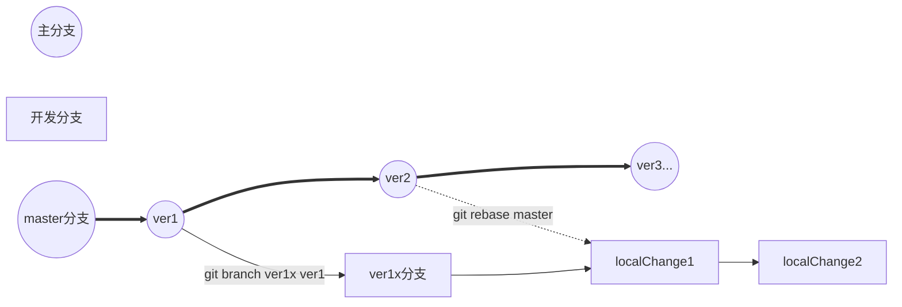

### git
git 是分布式仓库结构，在git中，工作区本身就是仓库。也就是说开发者拥有自己的仓库，它们之间不存在结构层面的上下关系，所有仓库都是并行存在的。

## 本地仓库的操作
```git init``` 当前文件夹创建为新的仓库

### 必要的git设置
添加当前仓库使用用户信息 name、email
```git config --add user.email "sino_1990@126.com"```
```git config --add user.name "chencheng"```
这个设置写入仓库目录的 ```.git/config```  文件中

```xml
[user]
	email = sino_1990@126.com
	name = chencheng
```
**git config**其他选项
```--global``` 用户已启动的所有仓库的设置  在```~/.gitconfig```文件中
```--system``` 整个系统的共同设置。 在```/etc/gitconfig```文件中
```bash
git config --global user.email "sino_1990@126.com"
git config --system user.name "chencheng"
```

### 将文件添加到仓库中
在git中向仓库中添加和修改文件的过程称为“提交”，提交分为两阶段进行，
首先 指定要提交的对象文件   **git add hello.c**
然后 进行实际的提交 **git commit**
```git add``` 将当前目录下的所有文件作为提交对象，加入GIT管理范围内
```git ls-files``` 查看**git**管理范围内的文件

```git diff```
工作区             缓存区          本地仓库
  \ ———V———/ \———V———/
         ```git diff```    ```git diff --cached```
     \—————V—————/
               ```git diff HEAD```

### 查看提交记录
**git log** 默认显示所有log记录， 以下<hash>只需输入一定长度（但至少4个字符）
```git log <hash9>```  到commitId为止 （包括<hash9>)
```git log <hash1>..``` 从<hash1>**之后** 到最新的提交为止 
```git log <hash1>..<hash9>``` 从<hash1> **之后 **到<hash9>为止

**HEAD** 表示最新的提交（默认值）
**HEAD^** or **HEAD~** or **HEAD~1**  上一次提交
**HEAD^^** or **HEAD~~** or **HEAD~2** 上两次提交


### 修改提交
```git revert HEAD``` 取消最新提交，**git log**记录不会被删除，还会增加一条“revert last commit”的记录
```git commit --amend``` 删除上次提交（工作区代码的修改不会撤销） 并重新提交
```git reset --soft HEAD~1``` 取消提交，同时记录也被删除，工作区代码维持原状
```git reset --hard HEAD~1``` 同上，区别是工作区代码也被恢复了

### 为提交加标签
```git tag tag1 [HEAD|HEAD^|commitId]```为最新的提交版本 打上标记tag1
```git tag -l``` 显示标签列表
```git push origin tagName:refs/tags/tagName``` 远程提交标签
```git tag -d tagName``` 本地删除标签
```git push origin :refs/tags/tagName``` 远程删除标签

### 创建分支
```git branch branch1 tag1``` 以标签tag1为起点，创建名为branch1x的分支
```git branch``` 查看分支列表，并用*标记当前所在分支
```git checkout branch1``` 切换到ver1x分支
```git branch -d branch1``` 删除 branch1 分支

### rebase命令 
当前分支branch1是以tag1为起点的，现在已经发布了ver2，要将起点更新为ver2
```git rebase master``` rebase到master的最新提交
```git rebase --onto ver2``` rebase到ver2



### 合并分支
经过一系列的修改提交，将ver1x作为verX进行发布，此时要将ver1x合并到master中
```git checkout master``` 切换到master分支
```git merge ver1x``` 将ver1x合并到master分支
解决冲突...
```git tag verX``` 打上**verX**标记


### 提取补丁
```git format-patch ver1..ver2``` 提取ver1到ver2的各次提交的差别提取补丁文件

### 提取源码树
```git archive --format=tar --prefix="hello-v2/" ver2 > ../hello-v2.tar``` 将ver2的源代码文件提取出来，不包括**.git**文件夹


## 与远程仓库进行共同作业
### 复制仓库
```git clone git://git.kernel.org/pub/scm/linux/kernel/git/torvalds/linux-2.6```
**复制本地仓库**
```git clone ./workCode/testGit local``` 会克隆testFGit仓库到当前local文件夹内

 ### 将本地 tag1 推送到远端服务器
 ```git push origin tag1```
  **push所有tag，命令格式为**：```git push [origin] --tags```

### 获取远程tag  tag-X
```git fetch origin tag tag-X```

### push本地分支branchLocal到服务器
```git push origin branchLocal```

### 获取远程分支
```git pull origin <远程分支名>:<本地分支名>```

### 删除远程分支

```git push origin --delete branchName```

### 远程删除文件（夹），而本地不受影响
``` shell
	git pull origin dev
	git rm -r --cached dirName/fileName
	git commit -m "删除了dirName"
	git push origin dev
```

### push一个已经存在的文件夹 到指定的远程仓库下
``` shell
git init
git remote add origin https://github.com/justOonion/myCase.git
git push -u origin master
```


