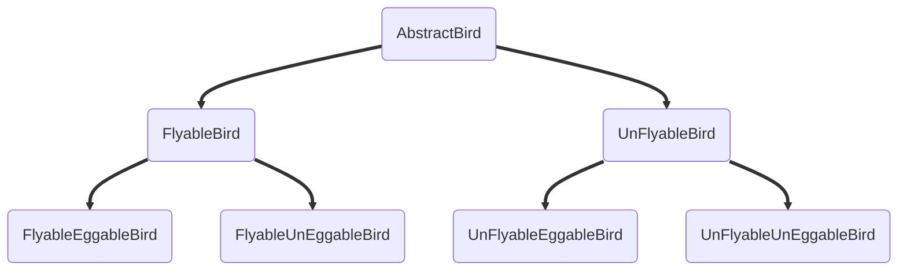

如何评判代码的好坏

灵活性 
可维护性
可扩展性
可读性
简洁性

可测试性


可读性：命令是否规范，代码层次清晰，类结构明确
简洁性：不要过度设计，能用简单的模式解决问题，绝不用复杂的设计模式
可维护性：这个是建立在可读性 和 可扩展性基础上的
可扩展性：需求有变更时，只需更改少量的代码，或完全不需要更改原有代码，只需新增类即可
灵活性：预留充足的可扩展点，提供可供复用的核心方法，接口考虑到所有可能性


面向对象，设计原则， 设计模式，编码规范， 重构

遗忘曲线告诉我们 只有不断重复才能吧短期记忆变为长期记忆！
分片记忆，制造前因后果
把记忆内容和有意义的，自己 感兴趣的事联系起来  借助思维导图等框架 记忆方式


### 封装

信息隐藏/数据访问保护， 是编程语言的访问限制机制（public， private）提供支持的

解决了哪些问题？
	保护了数据，解决了类数据 **不可控** 的问题
	提供有限的操作，提高类的 **易用性**

### 抽象

将大量的类 抽象出相同的特性，

与封装对数据隐藏不同，抽象隐藏的是具体功能的实现细节，调用者只需要关心类提供哪些功能，而无法知晓这些功能的实现细节。

抽象并不一定要有接口类，抽象类的支持，其实编程语言的函数本身就是抽象，我们调用函数，只需要关注函数的命名，注释，参数等信息，并不需要去了解底层的代码

解决了哪些问题？
	隐藏底层细节，释放脑容量
	类设计上：
	方法定义上：不要在方法定义上暴露实现细节，以保证将来要修改实现逻辑的时候，不需要修改方法的定义


### 继承

继承是表示类之间的 is-a 关系

继承最大的好处就是代码复用

通过继承来关联两个类，反应真实世界中的这种关系。从设计的角度来说，也有一种结构美感

但是很多人反映继承是个反模式，应该尽量少用，要多用组合 少用继承


### 多态

多态是指子类替换父类，在实际的代码运行过程中，调用子类的方法实现。


### 什么是面向过程编程和面向过程编程语言？面向对象编程有何优点？

面向对象编程 是以**类或对象**作为组织代码的基本单元，并将封装、抽象、继承、多态四个特性作为代码设计和实现的基石
相对来说，面向过程编程是以**过程**（可以理解为方法、函数、操作）作为组织代码的基本单元

显然面向对象编程能应对大规模复杂程序的开发
通过面向对象的机制，可以方便的对业务进行框架建模，此时无需考虑具体实现流程与细节，将角色和角色之间的关系先确定下来，然后逐个实现

**继承和多态**是面向对象编程 相比于面向过程编程所**特有**的两个特性！

**继承**可以将相同的属性和方法，抽取到父类中，实现了代码的复用

**多态**允许我们实现一个新的子类，重写原来的功能逻辑，用子类替换父类。而不用在原有代码中做修改，符合开闭原则，提高了扩展性


!!!但是并不是把方法和变量都塞到类里，就是面向对象编程了，也许你还是在编写面向过程的代码

## 面向过程风格的代码示例

### 滥用getter setter 方法

破坏类的封装特性，除非必要，否则不要加setter方法

### 滥用全局变量、全局方法

不要定义大而全的utils类 和 constants类


### 定义数据和方法分离的类(贫血模型)

面向过程开发，那就是，数据定义在一个类中，方法定义在一个类中。
实际上基于MVC三层结构做Web方面的后端开发，这样的代码已经根深蒂固了

**为什么我们很容易写出面向过程风格的代码？**
因为这个符合个人处理问题的根本逻辑
我们遇到一个问题需要解决时，往往会思考先做什么，后做什么，这样一步一步地顺序执行，最后完成整个任务
而面向对象的思维方式不是个人单枪匹马的实现所有功能，是分配好角色，大家各司其职，通力合作完成整个任务的过程


## 有些编程语言并没有提供抽象类或接口，我们如何用普通类实现呢？

抽象类就是为代码复用而生的，复用属性，复用代码。避免在多个子类中重复编写相同的代码

**如果只是代码复用的话， 普通的类也可以做到啊，为什么一定要抽象类呢？**
	普通类要想实现多态，就必须要定义空方法，让子类重写（但并不强制），这样实现没有抽象类（强制子类实现）优雅。 
	为什么不优雅？
		如果在普通父类定义一个空方法，会影响代码的可读性，不知道这个空方法是要被子类重写的
		当实现一个新的子类时，会忘记实现该空方法，而抽象类会强制要求实现
		普通父类可以被实例化，增加了误用的风险
		
**抽象类更多是为了代码复用，而接口就更侧重于解耦**

```java
// 普通类实现接口语法
public class MockInteface {
  protected MockInteface() {}
  public void funcA() {
    throw new MethodUnSupportedException();
  }
}
```
### 如何选择抽象类 还是 接口
接口表示的是 has-a 的关系， 抽象类表示的 is-a 的关系
抽象类一般是自下而上的设计思路，先有子类的代码重复，然后再抽象成上层的父类。
而接口是一种自上而下的设计思路，一般先有接口设计，再去考虑具体的实现


### 如何基于接口/抽象进行编程，是否有必要为每个类都定义对应的接口

接口本质是上是一组协议和约束，面向接口编程可以封装不稳定的内部实现，暴露稳定的接口。上游系统面向接口而非实现编程，不依赖不稳定的实现细节，当这样的实现发生变化时，上游代码基本不用修改，以此来降低耦合性，提高扩展性。

**抽象**就是提高代码扩展性、灵活性、可维护性的手段之一

很多人在定义接口的时候，希望通过实现类来反推接口的定义。先把实现类写好，然后看实现类中有哪些方法，照抄到接口定义中。这样就可能导致接口定义受限于具体的实现，不够抽象！
这样的接口设计就没有意义了。

**如何决定是否使用接口？**
这个问题很好解答，只要知道接口的设计初衷是什么，就自然而然的解决了。
**接口的设计初衷**：将接口于实现相分离，封装不稳定的实现，暴露稳定的接口。
所以如果业务系统中，某个功能只有一种实现方式，未来也不会被其他方式替换，就完全没有必要为其设计接口。


### 为什么要多用组合 少用继承


1 为什么不推荐使用继承 ？
		随着业务的变化， 继承层次会越来越深、继承关系也会越来越复杂
2 组合相对于继承，有哪些优势 ？
		利用组合、接口、委托完全可替代继承
			接口和组合 实现 is-a的关系
			接口可以实现多态
			其中组合 和 委托可以解决代码复用的问题
		组合的优势：
			层次结构清晰，继承关系明确
3 如何判断该用组合 还是继承 ？
	使用组合替换继承，意味着要做更细粒度的类拆分。
	这也就需要我们定义更多的类和接口。
	如果类之间的继承结构稳定，继承层次浅，继承关系不复杂，就应该大胆的用继承
	
### 为什么贫血模型的传统开发模式如此受欢迎？
	- 业务系统比较简单，基于sql的CRUD基本都能应付，所以，根本不需要动脑子精心设计充血模型
	- 不需要事先做太多设计，编码难度比较低
	- 思维固化，转型有成本

### 面向对象分析，面向对象设计，面向对象编程 的套路

1.需求不明确
	OOA 对象是需求（即需求分析）
		- 将笼统的需求细化
		- 通过沟通，挖掘，分析，假设，梳理，确定哪些是当前就要实现的， 哪些是未来要实现的

2.缺少设计经验
	例如鉴权这个功能，适合具体业务无关的一个功能，完全可以开发成一个独立的通用的框架，集成到业务系统中
	

需求分析的思路：
	组件化意识，框架意识，抽象意识
	先从满足自己的系统需求开始，然后再迭代优化
	
基础分析：
	1. 携带appId + passwd
	2. 明文传输不安全 url+appId+passwd 进行特殊的格式拼接 进行加密， 然后服务端获取密码 也进行同样的加密之后比较
	3. 引入时间戳，进行加密，并将时间戳明文传给服务端，服务端接收到请求首先验证时间戳是否在有效范围内，然后再去验证加密token的有效性
	4. 没有绝对的安全，只能去增加攻击的成本


### 面向对象设计
	- 划分职责 进而识别出有哪些类
	- 定义类及其属性和方法
	- 定义类与类之间的交互关系
	- 将类组装起来并提供执行入口

### 划分职责 识别出有哪些类
​	类是现实世界中事物的一个建模，但是对于一些抽象的概念，我们是无法通过映射现实世界中的事物的方式来定义类的
​	简单的识别类的方式：**罗列需求描述中的名词**，然后再进行筛选。
​	但是还有一种识别类的方式：**罗列需求中的功能点**，然后看哪些功能点职责相近，操作同样的属性，是否应该归为同一个类。


#### 需求描述：
- 调用方进行接口请求的时候，将 URL、AppID、密码、时间戳拼接在一起，通过加密算法生成 token，并且将 token、AppID、时间戳拼接在 URL 中，一并发送到微服务端。

- 微服务端在接收到调用方的接口请求之后，从请求中拆解出 token、AppID、时间戳。

- 微服务端首先检查传递过来的时间戳跟当前时间，是否在 token 失效时间窗口内。如果已经超过失效时间，那就算接口调用鉴权失败，拒绝接口调用请求。

- 如果 token 验证没有过期失效，微服务端再从自己的存储中，取出 AppID 对应的密码，通过同样的 token 生成算法，生成另外一个 token，与调用方传递过来的 token 进行匹配。如果一致，则鉴权成功，允许接口调用；否则就拒绝接口调用。


### 如何判定某个类的职责是否单一
一个类 或者 模块只负责完成一个职责（或者功能）
把模块看作比类更加粗粒度的代码块，模块中包含多个类，多个类组成一个模块

不管哪种理解方式，单一职责原则在应用到这两个描述对象的时候，道理都是相通的。为了方便你的理解，接下来我只从“类”设计的角度，来讲解如何应用这个设计原则。对于模块来说，你可以自行引申

单一职责原则的定义描述非常简单，也不难理解。一个类只负责完成一个职责或者功能。也就是说，不要设计大而全的类，要设计粒度小、功能单一的类。换个角度来讲就是，一个类包含两个或者两个以上业务不相干的功能，那我们就说它的职责不够单一，应该将它拆分成多个功能更加单一、粒度更细的类。

例如一个类中包含了订单的一些操作，又包含了用户的一些操作。而订单和用户是两个独立的业务模块，两个以上业务不相干的功能放到同一个类中，就违反了单一职责原则。

一般情况下是否违反单一职责原则 是非常难判定的！！！

不同的应用场景、不同阶段的需求背景下，对同一个类的职责是否单一的判定，可能都是不一样的。

**判断类是否职责单一几点小技巧**
- 类中的代码行数、函数或属性过多
- 类依赖的其他类过多，或者依赖类的其他类过多
- 私有方法过多
- 比较难给类起一个合适的名字
- 类中大量的方法都集中操作类的某几个属性

**那类职责是否设计得越单一越好呢**？
不是！类的设计除了要满足单一职责，更需要符合高内聚的特性，类似功能还是需要放到同一个类中

单一职责原则通过避免设计大而全的类，避免将不相关的功能耦合在一起，来提高类的内聚性。同时，类职责单一，类依赖的和被依赖的其他类也会变少，减少代码的耦合性，以此来实现代码的高内聚、低耦合。但是如果拆分得过细，实际上会适得其反，反而会降低内聚性，也会影响代码的可维护性。


### 开闭原则
添加一个新的功能应该是，在已有代码基础上扩展代码（新增模块，类，方法等），而不是修改已有代码（修改模块，类，方法等）

开发时要有**扩展意识，抽象意识，封装意识**，这比任何开发技巧都重要

开发时，多想想未来可能会有哪些变化，如何设计代码结构，事先留好扩展点

识别代码可变部分 和 不可变部分，将可变部分封装起来，隔离变化，提供抽象化的不可变接口给上层系统使用
当具体实现发生变化时，我们只需要基于相同的接口，扩展一个新的实现，替换掉老的实现即可，上游代码几乎不需要修改。


开闭原则的方法论：
- 1
- 2
- 3

最常用来提高代码扩展性的方法有：多态、依赖注入、基于接口而非实现编程


里式替换 和 多态看起来类似，但实际上他们完全是两回事。


